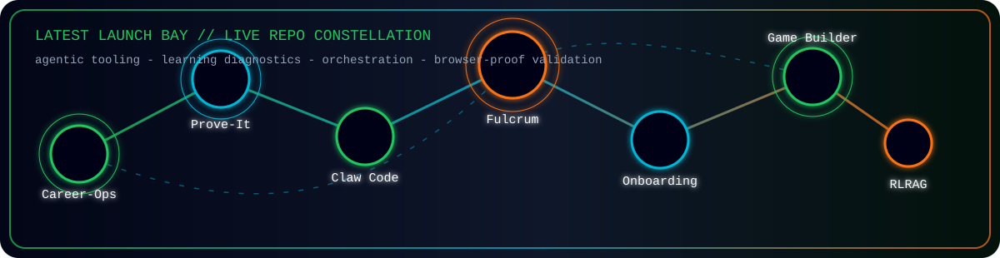
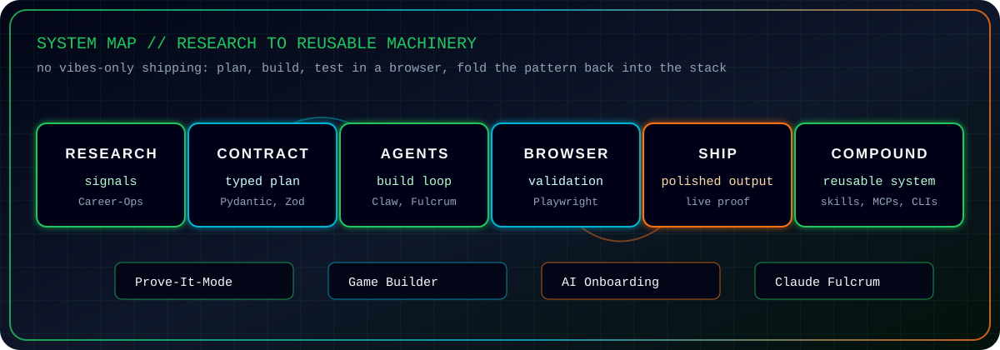

<div align="center">



<br>

<a href="https://git.io/typing-svg">
  
</a>

<br>


&nbsp;
<a href="https://github.com/ORION2809?tab=followers">
  
</a>
&nbsp;

&nbsp;

&nbsp;


</div>

<br>

<div align="center">

</div>

<br>

<table>
<tr>
<td width="100%" colspan="2" valign="top">

### `> whoami`

```json
{
  "name": "Shreyas Suvarna",
  "handle": "ORION2809",
  "mode": "agentic systems lab",
  "base": "India",
  "loop": "research → build → validate → ship → compound"
}
```

</td>
</tr>
<tr>
<td width="50%" valign="top">

### `> current_vector`

| Lane | Signal |
|:--|:--|
| 🔧 Agentic DevTools | CLIs, skills, workflows |
| 🤖 AI Orchestration | MCP, swarms, evaluators |
| 📦 Product Systems | Career ops, onboarding |
| 🧠 Learning Tech | Mental-model diagnostics |

</td>
<td width="50%" valign="top">

### `> ship_style`

| Bias | Output |
|:--|:--|
| Deterministic loops | Less agent chaos |
| Playwright checks | Real browser proof |
| Typed contracts | Cleaner handoffs |
| UX polish | Interfaces with pulse |

</td>
</tr>
</table>

<br>

<div align="center">

</div>

<br>

<div align="center">



</div>

<br>

<div align="center">

</div>

<div align="center">

## ⚡ Latest Launch Bay

<sub>Active projects in the agentic pipeline — each one ships with browser-proof validation</sub>

</div>

<table>
<tr>
<td width="50%" valign="top">

### Career-Ops

<a href="https://github.com/ORION2809/carrer-ops">
  
</a>

**AI-powered job search command center**

- Evaluates roles with structured fit scoring
- Generates ATS-oriented CV variants
- Scans Greenhouse, Ashby, Lever, and company portals
- Tracks the pipeline through a Go terminal dashboard

<p>


</p>

</td>
<td width="50%" valign="top">

### Prove-It-Mode

<a href="https://github.com/ORION2809/Prove-It-Mode">
  
</a>

**Mental model stress tester**

- Diagnoses hidden concept gaps before building
- Uses plausible-but-wrong code traps
- Replaces scoring with reflective diagnosis
- Runs on React, Vite, Tailwind, and NVIDIA-backed AI

<p>


</p>

</td>
</tr>
<tr>
<td width="50%" valign="top">

### Claw Code

<a href="https://github.com/ORION2809/claw-code">
  
</a>

**Rust coding-agent CLI with multi-provider support**

- Rust workspace for the `claw` CLI
- Claude, Grok, and OpenAI-compatible flows
- Plugin-aware tools, hooks, and permission features
- Interactive REPL plus one-shot prompt mode

<p>


</p>

</td>
<td width="50%" valign="top">

### Claude Fulcrum

<a href="https://github.com/ORION2809/claude-Fulcrum">
  
</a>

**Operating system for AI-powered development**

- 26 agents, 122 skills, 66 commands
- Shared memory across Claude Code, Codex, Cursor, and Copilot
- Swarm orchestration, hooks, and quality gates
- Design intelligence with searchable UI/UX systems

<p>


</p>

</td>
</tr>
<tr>
<td width="50%" valign="top">

### AI Onboarding Orchestrator

<a href="https://github.com/ORION2809/ai-onboarding-orchestrator">
  
</a>

**Multi-agent employee onboarding system**

- Saga orchestration across HR, IT, payroll, and facilities
- Express 5 plus Zod API surface
- LLM gateway with provider failover
- Audit trails, data lineage, chaos tests, and Prometheus metrics

<p>


</p>

</td>
<td width="50%" valign="top">

### Agentic Orchestration Engine

<a href="https://github.com/ORION2809/agentic-orchestration-engine">
  
</a>

**Deterministic Agentic Game Builder**

- Turns vague game ideas into playable HTML5 games
- Uses Pydantic contracts and explicit state transitions
- Validates with AST analysis plus Playwright runtime tests
- Ships as an MCP server with Docker packaging

<p>


</p>

</td>
</tr>
</table>

<br>

<div align="center">

</div>

<br>

<div align="center">

## 🗺️ System Map

<sub>No vibes-only shipping — plan, build, test in a browser, fold the pattern back into the stack</sub>

</div>

<br>

<div align="center">



</div>

<br>

<table>
<tr>
<th>Phase</th>
<th>Proof</th>
<th>Project Signal</th>
</tr>
<tr>
<td>🔍 Research signals</td>
<td>Capture the rough problem and weird edge cases</td>
<td><b>Career-Ops</b>, <b>Prove-It-Mode</b></td>
</tr>
<tr>
<td>📝 Typed plan</td>
<td>Force the handoff into contracts</td>
<td><b>Agentic Orchestration Engine</b></td>
</tr>
<tr>
<td>🤖 Agentic build loop</td>
<td>Ship with tools, agents, and memory</td>
<td><b>Claw Code</b>, <b>Claude Fulcrum</b></td>
</tr>
<tr>
<td>🌐 Browser validation</td>
<td>Let Playwright call the bluff</td>
<td><b>AI Onboarding Orchestrator</b></td>
</tr>
<tr>
<td>♻️ Reusable system</td>
<td>Fold the pattern back into the stack</td>
<td><b>Fulcrum skills</b>, <b>MCPs</b>, <b>CLIs</b></td>
</tr>
</table>

<br>

<div align="center">

</div>

<br>

<div align="center">

## 📡 Stack Radar

<sub>Multi-runtime competency map — hover over the radar to explore</sub>

</div>

<br>

<div align="center">



</div>

<br>

<div align="center">

</div>

<br>

<div align="center">

## 📊 Telemetry

<sub>Real-time signal from the contribution graph</sub>

</div>

<br>

<div align="center">


<br>

<picture>
  <source media="(prefers-color-scheme: dark)" srcset="https://raw.githubusercontent.com/ORION2809/ORION2809/output/github-contribution-grid-snake-dark.svg" />
  <source media="(prefers-color-scheme: light)" srcset="https://raw.githubusercontent.com/ORION2809/ORION2809/output/github-contribution-grid-snake.svg" />
  
</picture>

</div>

<br>

<div align="center">

</div>

<br>

<div align="center">

## 🗄️ Signal Archive

<sub>Earlier explorations that shaped the current stack</sub>

</div>

<br>

<table>
<tr>
<th>Project</th>
<th>What it proved</th>
</tr>
<tr>
<td><a href="https://github.com/ORION2809/XAI_Tachycardia-"><b>XAI Tachycardia</b></a></td>
<td>Explainable cardiac-event detection with SHAP/LIME thinking</td>
</tr>
<tr>
<td><a href="https://github.com/ORION2809/aquaculture_ai"><b>Aquaculture AI</b></a></td>
<td>Farm intelligence, predictive signals, and recommendation engines</td>
</tr>
<tr>
<td><a href="https://github.com/ORION2809/3D_OBJECT_VIEW"><b>3D Object View</b></a></td>
<td>Browser-based 3D interaction experiments</td>
</tr>
<tr>
<td><a href="https://github.com/ORION2809/aqua_web_3d"><b>Aqua Web 3D</b></a></td>
<td>Immersive aquaculture web experience</td>
</tr>
<tr>
<td><a href="https://github.com/ORION2809/RLRAG-Cost-Aware-Retrieval-Depth-Control-for-Production-RAG"><b>RLRAG</b></a></td>
<td>Cost-aware retrieval-depth control for production RAG</td>
</tr>
</table>

<br>

<div align="center">

</div>

<br>

<div align="center">



<br>

<a href="https://github.com/ORION2809">
  
</a>
&nbsp;
<a href="https://github.com/ORION2809/portfoliowebsite">
  
</a>
&nbsp;
<a href="https://github.com/ORION2809?tab=repositories">
  
</a>
&nbsp;
<a href="https://github.com/ORION2809/claude-Fulcrum">
  
</a>

<br><br>


</div>
