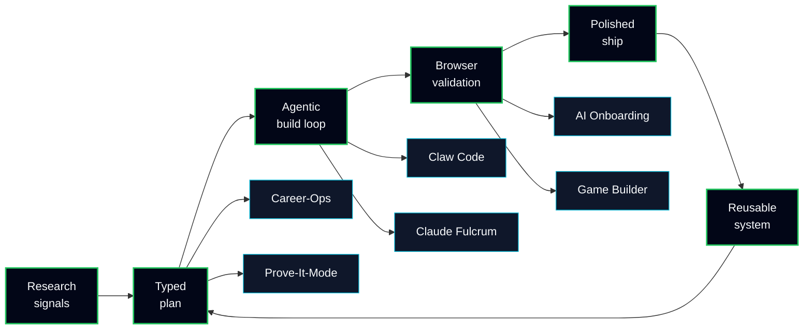

<div align="center">



<br>

<a href="https://git.io/typing-svg">
  
</a>

<br>


<a href="https://github.com/ORION2809?tab=followers">
  
</a>


</div>

---

<table>
<tr>
<td width="34%" valign="top">

### CONTROL SIGNAL

```json
{
  "name": "Shreyas Suvarna",
  "handle": "ORION2809",
  "mode": "agentic systems lab",
  "base": "India",
  "loop": "research -> build -> validate -> ship"
}
```

</td>
<td width="33%" valign="top">

### CURRENT VECTOR

| Lane | Signal |
|:--|:--|
| Agentic DevTools | CLIs, skills, workflows |
| AI Orchestration | MCP, swarms, evaluators |
| Product Systems | Career ops, onboarding |
| Learning Tech | Mental-model diagnostics |

</td>
<td width="33%" valign="top">

### SHIP STYLE

| Bias | Output |
|:--|:--|
| Deterministic loops | Less agent chaos |
| Playwright checks | Real browser proof |
| Typed contracts | Cleaner handoffs |
| UX polish | Interfaces with pulse |

</td>
</tr>
</table>

<div align="center">


</div>

---

## Latest Launch Bay

<table>
<tr>
<td width="50%" valign="top">

### Career-Ops

<a href="https://github.com/ORION2809/carrer-ops">
  
</a>

**AI-powered job search command center**

- Evaluates roles with structured fit scoring
- Generates ATS-oriented CV variants
- Scans Greenhouse, Ashby, Lever, and company portals
- Tracks the pipeline through a Go terminal dashboard

<p>


</p>

</td>
<td width="50%" valign="top">

### Prove-It-Mode

<a href="https://github.com/ORION2809/Prove-It-Mode">
  
</a>

**Mental model stress tester**

- Diagnoses hidden concept gaps before building
- Uses plausible-but-wrong code traps
- Replaces scoring with reflective diagnosis
- Runs on React, Vite, Tailwind, and NVIDIA-backed AI

<p>


</p>

</td>
</tr>
<tr>
<td width="50%" valign="top">

### Claw Code

<a href="https://github.com/ORION2809/claw-code">
  
</a>

**Rust coding-agent CLI with multi-provider support**

- Rust workspace for the `claw` CLI
- Claude, Grok, and OpenAI-compatible flows
- Plugin-aware tools, hooks, and permission features
- Interactive REPL plus one-shot prompt mode

<p>


</p>

</td>
<td width="50%" valign="top">

### Claude Fulcrum

<a href="https://github.com/ORION2809/claude-Fulcrum">
  
</a>

**Operating system for AI-powered development**

- 26 agents, 122 skills, 66 commands
- Shared memory across Claude Code, Codex, Cursor, and Copilot
- Swarm orchestration, hooks, and quality gates
- Design intelligence with searchable UI/UX systems

<p>


</p>

</td>
</tr>
<tr>
<td width="50%" valign="top">

### AI Onboarding Orchestrator

<a href="https://github.com/ORION2809/ai-onboarding-orchestrator">
  
</a>

**Multi-agent employee onboarding system**

- Saga orchestration across HR, IT, payroll, and facilities
- Express 5 plus Zod API surface
- LLM gateway with provider failover
- Audit trails, data lineage, chaos tests, and Prometheus metrics

<p>


</p>

</td>
<td width="50%" valign="top">

### Agentic Orchestration Engine

<a href="https://github.com/ORION2809/agentic-orchestration-engine">
  
</a>

**Deterministic Agentic Game Builder**

- Turns vague game ideas into playable HTML5 games
- Uses Pydantic contracts and explicit state transitions
- Validates with AST analysis plus Playwright runtime tests
- Ships as an MCP server with Docker packaging

<p>


</p>

</td>
</tr>
</table>

---

## System Map



---

## Stack Radar

<table>
<tr>
<td width="25%" valign="top">

### AI


</td>
<td width="25%" valign="top">

### Runtime


</td>
<td width="25%" valign="top">

### Frontend


</td>
<td width="25%" valign="top">

### Proof


</td>
</tr>
</table>

---

## Telemetry

<div align="center">


<br>

<picture>
  <source media="(prefers-color-scheme: dark)" srcset="https://raw.githubusercontent.com/ORION2809/ORION2809/output/github-contribution-grid-snake-dark.svg" />
  <source media="(prefers-color-scheme: light)" srcset="https://raw.githubusercontent.com/ORION2809/ORION2809/output/github-contribution-grid-snake.svg" />
  
</picture>

</div>

---

## Older Signal Archive

| Project | What it proved |
|:--|:--|
| [XAI Tachycardia](https://github.com/ORION2809/XAI_Tachycardia-) | Explainable cardiac-event detection with SHAP/LIME thinking |
| [Aquaculture AI](https://github.com/ORION2809/aquaculture_ai) | Farm intelligence, predictive signals, and recommendation engines |
| [3D Object View](https://github.com/ORION2809/3D_OBJECT_VIEW) | Browser-based 3D interaction experiments |
| [Aqua Web 3D](https://github.com/ORION2809/aqua_web_3d) | Immersive aquaculture web experience |
| [RLRAG](https://github.com/ORION2809/RLRAG-Cost-Aware-Retrieval-Depth-Control-for-Production-RAG) | Cost-aware retrieval-depth control for production RAG |

---

<div align="center">

### Ship the loop. Prove the loop. Make the loop remember.

<a href="https://github.com/ORION2809">
  
</a>
<a href="https://github.com/ORION2809/portfoliowebsite">
  
</a>
<a href="https://github.com/ORION2809?tab=repositories">
  
</a>

<br>


</div>
